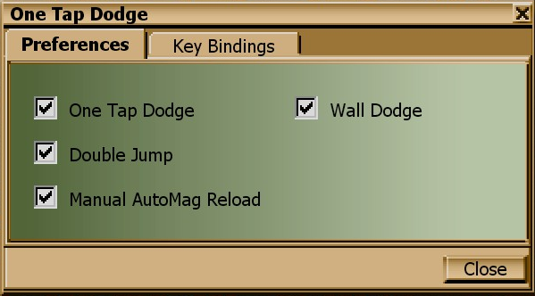
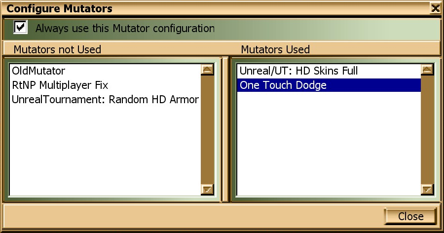

# One Tap Dodge (OTD) for Unreal Gold (OldUnreal)

**One Tap Dodge (OTD)** is a movement mod for **Unreal Gold** that brings modern dodge mechanics to classic Unreal gameplay.

It adds a **one-tap dodge** system (press a trigger key once to activate dodge as opposed to classic double-tapping.) and a **wall dodge** mechanic (dodge near a wall to gain a vertical boost) introduced in UT2k3 and later, with an in-game options menu to toggle on/off.

---

## What is it?

This mod aims to provide a modern alternative to the classic double-tapping dodge system, similar to what was available in the UT4 alpha (RIP🙏) or FoxMod for UT3:

- ✅ Now you can dodge reliably with a single key press.
- ✅ No more accidentally **jumping off cliffs** or **diving into lava**!
- ✅ Optionally, you can even wall dodge like it's 2003!!
- ✅ **In-game options window** to toggle on/off **One Tap Dodge** and **Wall Dodge**.
- ✅ Designed to work with both the **OG** and **Return to Na Pali (RtNP)** campaigns.







### Requirements

- You need **Unreal Gold** with **at least OldUnreal 227j or later** (the mod uses the `ModifyPlayerSpawnClass` hook).

> ⚠️ **OldUnreal 227k or later is strongly recommended** for the best compatibility.

### Acknowledgments

Finally, This mod is based on the original **One Tap Dodge** work by **Cadrin** created for UT99, which can be found here:

- https://www.moddb.com/games/unreal-tournament/downloads/onetapdodge-v1

---

## Installation

### Quick install

1. Download the latest build from [here](https://github.com/MegatimusPrime/otd-for-oldunreal/releases/latest).
2. Extract the archive into your Unreal Gold `System/` folder.

The resulting layout should look like:

```text
<Unreal Gold install>/System/OTD_Config.u
<Unreal Gold install>/System/OTD_Config.int
<Unreal Gold install>/System/OTD_Mutator.u
<Unreal Gold install>/System/OTD_Mutator.int
<Unreal Gold install>/System/OTD_PlayerPawn.u
```

### Build from source (Optional)

Alternatively, If you want to build from source, you must compile the UnrealScript packages using `ucc` (UnrealScript compiler) included with OldUnreal.

- https://wiki.beyondunreal.com/Legacy:Compiling_With_UCC

#### Creating the `*.int` file

To make the mutator configurable/selectable from the in-game menu, create following `*.int` files and place them in the `System` folder. (These are already included in release build.)

`OTD_Config.int`:

```ini
[Public]
Object=(Name=OTD_Config.OTD_MenuItem,Class=Class,MetaClass=UMenu.UMenuModMenuItem,Description="One Tap Dodge Configuration, Enable/disable the One Tap Dodge mod and set the keys to dodge.")
```

`OTD_Mutator.int`:

```ini
[Public]
Object=(Name=OTD_Mutator.OTD_PlayerSpawnMutator,Class=Class,MetaClass=Engine.Mutator,Description="One Touch Dodge")
```


